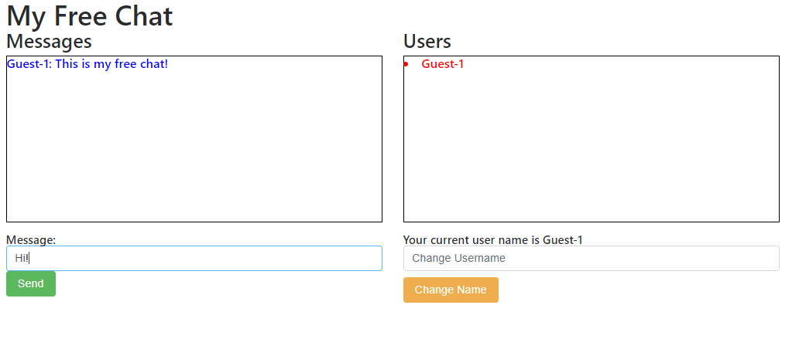
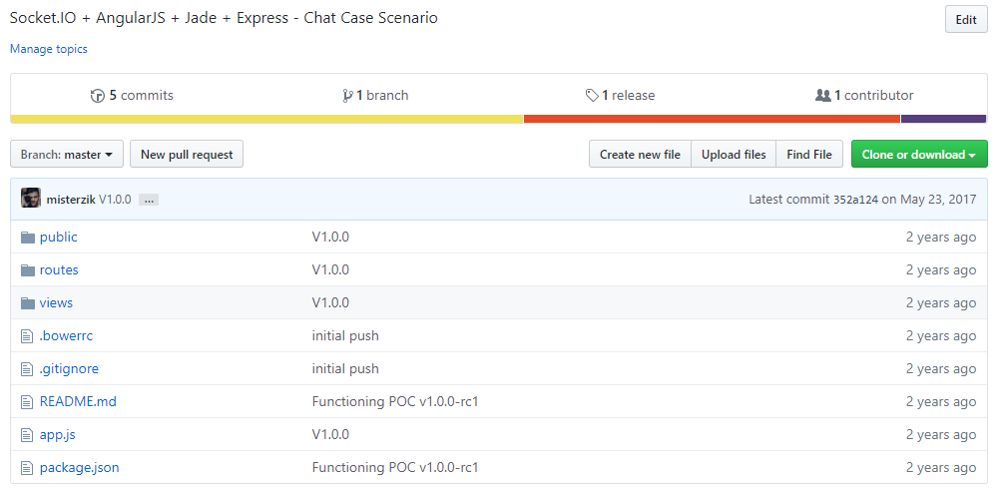

# AngularJS + Jade with SocketIO 

AngularJS and Jade for Front-end with SocketIO wrapped around express. 

## Running it

Make sure to have Node.JS installed in your system with NPM.

 1) Grab the dependencies with npm:

    `npm install`

2) If any Angular dependencies through bower, you will need bower, you can get it through npm, (https://bower.io/) by using

    `npm install -g bower`
To install Globally in your System.

3) after installing bower then do on the command line.

    `bower install`

wherever you see an .bowerrc and it will download angular dependencies, i have also included the depencies in a folder due to the deprecation of most of the libraries...

4) after all of that is done, Go back to Root folder, where `app.js` is located and run server by typing...

    `node app.js`

5) Navigate on your browser to `localhost:3000`

### Legacy Dependencies :

1) AngularJS
2) Jade
3) SocketIO
4) Express

### History Snapshot:

so why snapshot's? in order to be able to make all this public, there is a lot of clean up to do specially with some of this old deprecated code and private tokens, so in order for me to do that i've to erase all commits for all our script kiddies out there.

